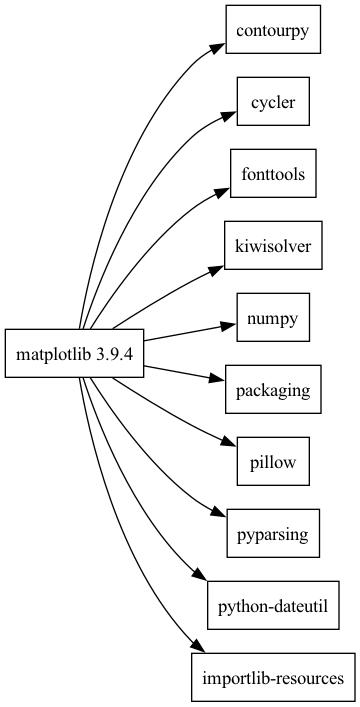
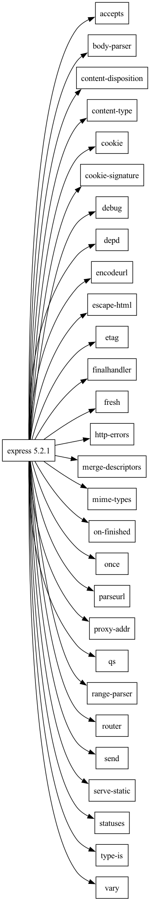

### Задание 1

```bash
python3 -m pip show matplotlib
```

```bash
git clone --depth 1 --branch v3.9.4 https://github.com/matplotlib/matplotlib.git matplotlib-source
```

### Задание 2

```bash
npm pack express@5.2.1
tar -xOf express-5.2.1.tgz package/package.json
```

```bash
git clone --depth 1 https://github.com/expressjs/express.git express-source
```

### Задание 3

```bash
dot -Tpng matplotlib.dot -o matplotlib.png
dot -Tpng express.dot -o express.png
```




